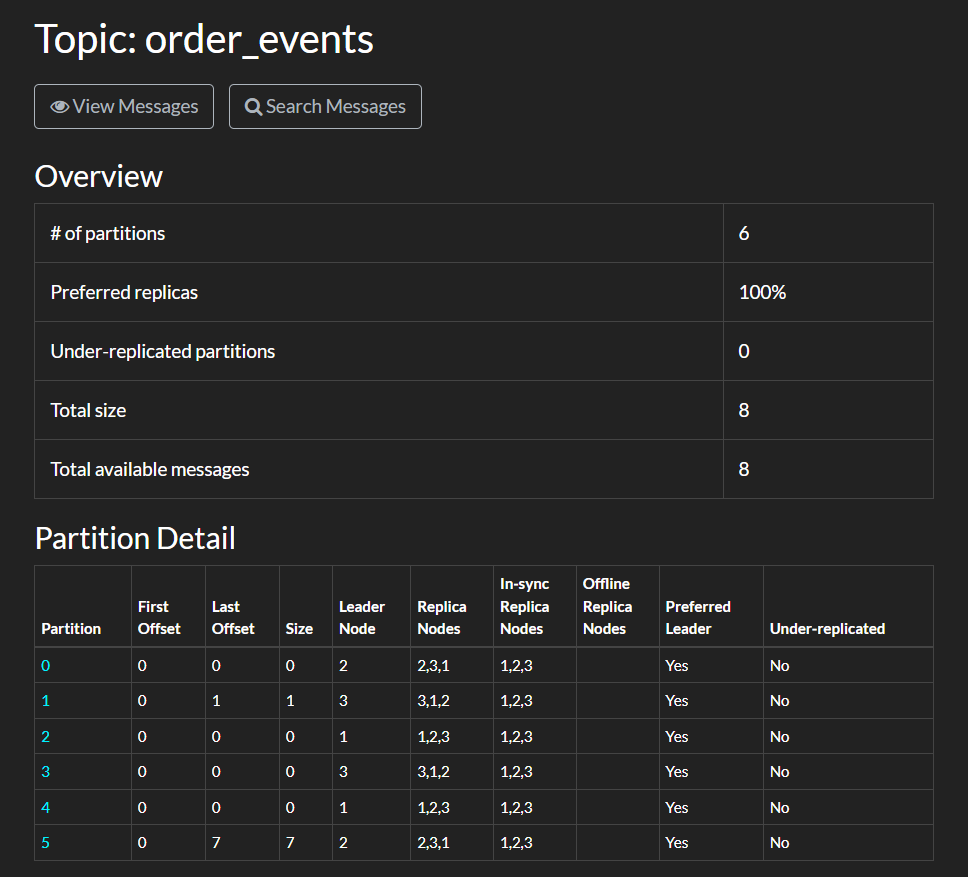
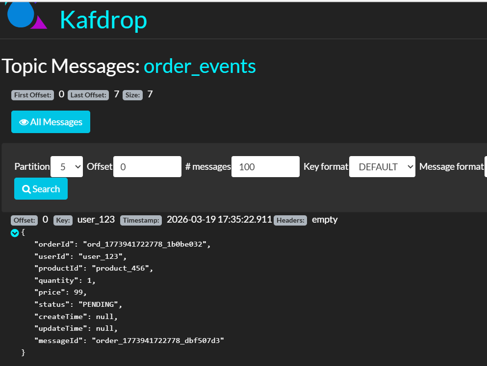

# FlashStream：高并发秒杀与实时库存系统


## 项目简介

FlashStream 是一个专注于 **Kafka 实战教学** 的电商秒杀系统。通过三个阶段的递进式实践，帮助开发者深入理解 Kafka 在高并发场景下的流量削峰、异步处理和数据一致性方面的强大能力。

## 业务场景

在促销秒杀活动中，瞬间流量可达平时的 100-1000 倍。如果所有请求直接访问数据库，系统会瞬间崩溃。Kafka 在此场景下发挥核心作用：

```
用户下单请求 → [削峰填谷] → Kafka Topic → 异步消费 → 库存服务/通知服务/积分服务
```

## 图片





## 系统架构

```
┌─────────────┐     ┌──────────────────────────────────────────────┐
│   前端应用   │────▶│              Order Service (Producer)       │
└─────────────┘     │  • 接收HTTP请求                                │
                    │  • 消息序列化                                  │
                    │  • 分区策略(同用户同分区)                      │
                    └──────────────────┬───────────────────────────┘
                                       │ 写入 Kafka
                                       ▼
┌─────────────────────────────────────────────────────────────────────┐
│                    Kafka Cluster (KRaft 模式, 3 Brokers)            │
│  ┌─────────────┐  ┌─────────────┐  ┌─────────────┐                  │
│  │ Broker 1    │  │ Broker 2    │  │ Broker 3    │                  │
│  │ Controller  │  │ Controller   │  │ Controller   │                  │
│  └─────────────┘  └─────────────┘  └─────────────┘                  │
└────────────────────────────┬────────────────────────────────────────┘
                              │ 消费
         ┌────────────────────┼────────────────────┐
         ▼                    ▼                    ▼
┌───────────────┐    ┌───────────────┐    ┌───────────────┐
│Inventory      │    │Notification   │    │Points         │
│Service        │    │Service        │    │Service        │
│• 库存扣减     │    │• 短信通知    │    │• 积分添加     │
│• 分布式锁     │    │               │    │               │
└───────────────┘    └───────────────┘    └───────────────┘
```

## 技术栈

| 层次 | 技术选型 |
|------|----------|
| 语言 | Java 17+ |
| 框架 | Spring Boot 3.2.x |
| 消息中间件 | Apache Kafka 3.7 (KRaft 模式) |
| 缓存 | Redis (分布式锁、幂等校验) |
| 数据库 | MySQL 8.0 |
| 可视化 | Kafdrop |
| 容器 | Docker Compose |

## 快速开始

### 1. 启动基础设施

```bash
# 启动 Kafka 集群 (KRaft 模式，无需 Zookeeper)
docker-compose up -d

# 等待服务就绪 (首次约 60 秒)
docker-compose ps

# 验证 Kafka
docker exec kafka-1 /opt/kafka/bin/kafka-topics.sh --list --bootstrap-server localhost:9091
```

### 2. 构建项目

```bash
# 构建所有模块
mvn clean package -DskipTests
```

### 3. 启动服务

```bash
# 终端1: 订单服务 (端口 8081)
java -jar order-service/target/order-service-1.0.0.jar

# 终端2: 库存服务 (端口 8082)
java -jar inventory-service/target/inventory-service-1.0.0.jar

# 终端3: 通知服务 (端口 8083)
java -jar notification-service/target/notification-service-1.0.0.jar
```

### 4. 测试接口

```bash
# 模拟秒杀下单
curl -X POST http://localhost:8081/api/orders \
  -H "Content-Type: application/json" \
  -d '{
    "userId": "user_123",
    "productId": "product_456",
    "quantity": 1,
    "price": 99.00
  }'
```

### 5. 查看可视化界面

- **Kafdrop**: http://localhost:9001 (Topic 浏览、消息查看、消费者组状态)

## 端口映射

| 服务 | 端口 | 说明 |
|------|------|------|
| Kafka Broker 1 | 9091 | 主端口 |
| Kafka Broker 2 | 9092 | 主端口 |
| Kafka Broker 3 | 9093 | 主端口 |
| Kafdrop | 9001 | Web 可视化 |
| Redis | 6379 | 缓存/幂等 |
| MySQL | 3306 | 数据库 |

## 实战任务路径

### 阶段一：基础连通
- [ ] 使用 KafkaAdminClient 创建 Topic
- [ ] 实现基础 Producer 发送消息
- [ ] 实现基础 Consumer 消费消息

### 阶段二：可靠性与幂等性
- [ ] 配置 Producer acks=all 和 retries
- [ ] 实现 Consumer 幂等性消费（Redis 防重）
- [ ] 处理消息丢失和重复问题

### 阶段三：高级特性
- [ ] 动态增加分区，观察 Rebalance
- [ ] 配置批量消费参数
- [ ] 实现分区重分配策略

## 测试工具

```bash
# Linux/Mac: 运行测试脚本
./scripts/producer-stress-test.sh       # 生产者压测
./scripts/consumer-stress-test.sh       # 消费者压测
./scripts/view-metrics.sh              # 交互式指标查看
./scripts/test-idempotency.sh           # 幂等性验证
./scripts/test-rebalance.sh             # Rebalance 测试

# Windows: 运行批处理
test-tools.bat                          # 测试工具集菜单
```

## 项目结构

```
FlashStream/
├── docker-compose.yml          # Kafka 集群配置 (KRaft)
├── order-service/              # 订单服务 (Producer)
├── inventory-service/          # 库存服务 (Consumer)
├── notification-service/       # 通知服务 (Consumer)
├── common/                     # 公共模块
├── sql/                        # 数据库脚本
├── scripts/                    # 测试脚本
└── docs/                       # 教学文档
```

## 学习收获

通过本项目，你将掌握：

1. **Kafka KRaft 模式**: 取代 Zookeeper 的新型控制器
2. **Kafka 核心概念**: Topic、Partition、Replica、ISR、Consumer Group
3. **生产者机制**: 消息序列化、分区策略、acks 机制、重试策略
4. **消费者机制**: 消费组、位移管理、Rebalance
5. **可靠性保证**: 幂等性、事务、消息不丢不重
6. **性能优化**: 批量发送、压缩、消费者优化

## 注意事项

⚠️ 本项目为教学项目，生产环境使用需根据实际情况调整配置。

---

**开始你的 Kafka 实战之旅吧！**
